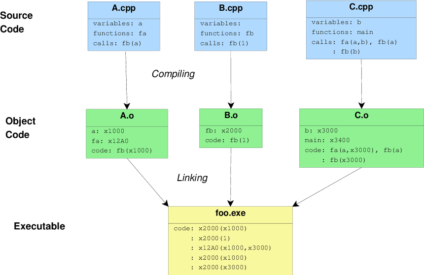

# c언어에 대한 기본

## 프로그램 생성 과정
1. 전처리(Preprocessing) 
- 전처리기를 통해 헤더파일 혹은 메크로를 치환하여, 결과를 **.i** 파일 확장자 명으로 저장한다.
2. 컴파일(Compile)
- 컴파일러는 저수준의 언어인 어셈블리어로 컴파일 후, 결과를 **.s** 파일 확장자 명으로 저장한다. 
3. 어셈블(Assemble)
- 어셈블러는 저수준의 언어인 어셈블리어를 링커가 읽을 수 있는 목적 파일로 변환해, 결과를 **.o** 파일 확장자 명으로 저장한다. 
4. 링킹(Linking)
- 링커는 파일 확장자가 **.o**인 목적파일들을 하나로 묶어 **실행파일(a.out)**로 생성한다. 

위 4가지 동작을 Compiler Collection (컴파일러 모음집)이라고 부르며, 잘 알려진 모음집으로 GCC(GNU Compiler Collection)과 LLVM(Low Level Virtual Machine)이 있다. 

## LLVM & GCC & Clang
1. LLVM이란? 
- LLVM은 Low Level Virtual Machine의 약자이다. LLVM은 컴파일러 인프라스트럭처이다. LLVM을 이용해서 컴파일을 한다. LLVM 내에는 여러 프로젝트가 있는데 대표적으로 LLVM Code와 Clang 등이 있다.

2. CLang이란?
- Clang이란 C,C++,Objective-C++ 언어를 컴파일하기 위한 LLVM에 속한 프론트엔드 컴파일러이다. 

3. GCC와 Clang의 차이점
- GCC가 Clang보다 더 많은 언어를 지원한다. Clang은 GCC에 비해 컴파일 속도가 빠르고 메모리 사용량이 적다. 라이블러리 기반의 모듈식 디자인으로 IDE 통합이 용이하고 더 나은 오류 진단을 제공한다. 

