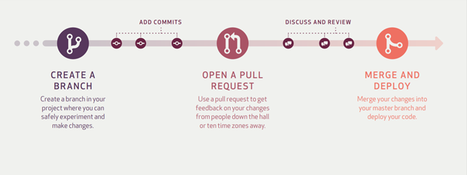
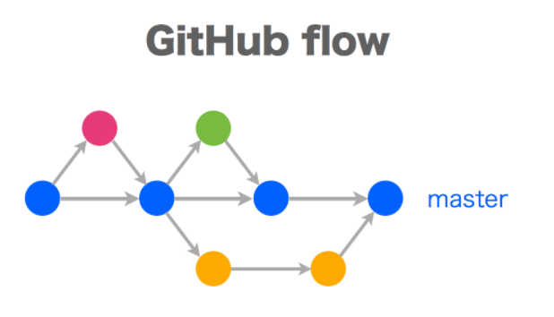

# GitHub Flow 전략

## 특징
- main(master) 브랜치는 항상 최신 상태며, stable 상태로 product에 배포되는 브랜치다. 
- 새로운 브랜치는 항상 master 브랜치에서 만든다.
- git-flow와는 다르게 feature 브랜치나 develop 브랜치가 존재하지 않는다. 
- 새로운 기능을 추가하거나 버그를 해결하기 위한 **브랜치 이름은 자세하게** 어떤 일을 하고 있는지에 대해서 작성해야 한다.
- master로 merge가 일어나면 자동으로 배포가 되도록 설정해놓는다. (CI/CD)
- 

## 사용법
1. 브랜치 생성
2. 개발 & 커밋 & 푸쉬
3. PR(Pull Request) 생성
4. 리뷰 & 토의
5. 테스트
6. 최종 Merge

## 예시
1. rainbow **브랜치를 만든다**
2. rainbow 파일을 추가하고 **커밋**한다.
3. rainbow 브랜칠를 원격 저장소에 **Push** 한다
4. Github에서 푸시 된 rainbow 브랜치를 **Pull Request** 한다.
5. Github에서 **리뷰 후 Merge** 한다.
6. 로컬 저장소에서 원격 저장소에 머지된 내용을 **Pull** 한다.
