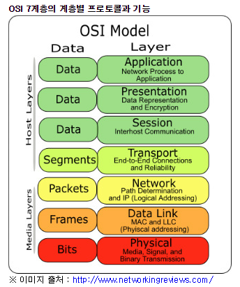
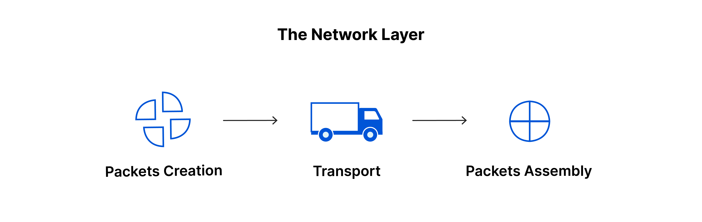
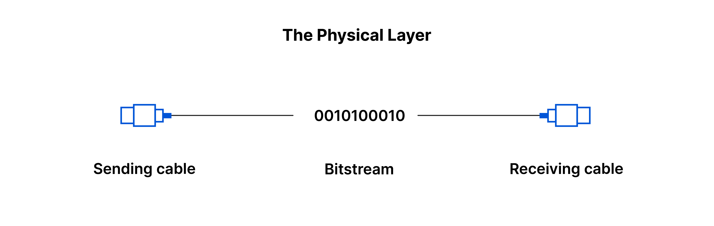

# OSI(Open Systems Interconnection) 7계층 모형

# 7계층 - Application Layer - 응용 계층
- 사용자와 가장 밀접한 계층, 인터페이스 역할
- 응용 프로세스 간의 정보 교환 담당 / 전송 단위
- ex : Skype, Google Chrome..

# 6계층 - Presentation Layer - 표현 계층
- 응용 계층의 데이터 표현에서 독립적인 부분을 나타낸다. 
- 일반적으로 응용프로그램 형식을 준비 또는 네트워크 형식으로 변환하거나 네트워크 형식을 응용프로그램 형식으로 변환하는 것을 나타낸다.
- 데이터의 변환 작업을 하는 계층

# 5계층 - Session Layer - 세션 계층
- 2대의 기기, 컴퓨터 또는 서버간에 "대화"가 필요하면 세션을 만들어야 하는데 이 작업이 여기서 처리된다. 
- 통신이 시작될 때부터 종료될 때까지의 시간을 세션이라고 한다.
- 세션 계층은 교환되고 있는 모든 데이터를 전송할 수 있도록 충분히 오랫동안 세션을 개방한 다음 리소스를 낭비하지 않기 위해 세션을 즉시 닫을 수 있도록 보장한다.
- 통신장치 간 상호작용 및 동기화를 제공
- 연결 세션에서 데이터 교환, 에러 발생 시 복구 관리 
- 응용 프로그램 간의 연결을 지원해주는 계층

# 4계층 - Transport Layer - 전송 계층
- 최종 시스템 및 호스트 간의 데이터 전송을 담당한다. 
- 보낼 데이터의 용량과 속도, 목적지 등을 처리한다. 
- TCP, UDP가 그 예시다.
- 종단 간(End-to-End)에 신뢰성 있고 정확한 데이터 전송을 담당 (전송단위 : Segment)
- 장비 : L4 스위치 (3계층 트래픽 분석, 서비스 종류 구분)
- 서비스를 구분하고 데이터의 전송 방식을 담당하는 계층

# 3계층 - Network Layer - 네트워크 계층
- 
- 서로 다른 두 네트워크 간 데이터 전송을 용이하게 하는 역할
- 서로 통신하는 두 장치가 동일한 네트워크에 있는 경우에는 네트워크 계층이 필요하지 않음
- 네트워크 계층은 전송 계층의 **세그먼트**를 송신자의 장치에서 **패킷**이라고 불리는 더 작은 단위로 세분화
- 수신 장치에서는 이러한 패킷을 다시 조립합니다. 
- 네트워크 계층은 데이터가 표적에 도달하기 위한 최상의 물리적 경로를 찾는데 이를 **라우팅**이라고 합니다.
- ex : IP, ICMP, IPsec..

# 2계층 - Data Link Layer - 데이터 연결 계층
- 데이터 연결 계층은 네트워크 계층과 매우 비슷하지만, 데이터 연결 계층은 동일한 네트워크에 있는 두 개의 장치 간 데이터 전송을 용이하게 한다. 
- 데이터 연결 계층은 네트워크 계층에서 패킷을 가져와서 프레임이라고 불리는 더 작은 조각으로 세분화한다.

# 1계층 - Physical Layer - 물리적 계층
- 
- 케이블, 스위치 등 데이터 전송과 관련된 물리적 장비가 포함됨
- 1과0의 문자열인 **비트 스트림**으로 변환되는 계층이다.

# OSI 모델을 통해 데이터가 전송되는 방법

- 쿠퍼 씨가 파머 씨에게 이메일을 보내려고 한다.
- 쿠퍼 씨는 자신의 노트북에 있는 이메일 어플리케이션에서 메시지를 작성하고 발송 버튼을 누른다.

- ### 송신
- 쿠퍼 씨의 이메일 애플리케이션이 이메일 메시지를 애플리케이션 계층으로 넘기면, 애플리케이션 레이어는 프로토콜(SMTP)을 선택하고, 데이터를 프레젠테이션 계층으로 전달한다.
- 프레젠테이션 계층이 압축한 데이터는 세션 계층에 도달하고, 세션 계층은 세션을 시작한다.
- 데이터는 **발신자의 전송 계층**으로 넘어가 세그먼트로 나눠지게 된다.
- 이 세그먼트는 네트워크 계층에서 **패킷**으로 다시 나눠진다.
- 이는 데이터 연결 계층에서 **프레임**으로 나눠진다.
- 데이터 링크 계층은 해당 프레임을 물리적 계층으로 전달하며, 물리적 계층은 데이터를 **1과 0의 비트스트림**으로 변환하고 **물리적 매체**를 통해 전송한다.
- 파머 씨의 컴퓨터가 물리적 매체(ex: wifi)를 통해 비트스트림을 수신하면, 데이터는 반대 순서로 계층을 지나게 된다.
- ### 수신
- 물리적 계층은 비트 스트림을 1과 0에서 프레임으로 변환해 데이터 연결 계층으로 넘긴다.
- 데이터 연결 계층은 프레임을 패킷으로 재조립해 네트워크 계층으로 넘긴다.
- 네트워크 계층은 패킷으로 세그먼트를 만들어 전송 계층으로 넘긴다.
- 전송 계층은 세그먼트를 재조립해 하나의 데이터를 만든다.
- 데이터는 수신자의 세션 계층으로 흐르고, 세션 계층이 이 데이터를 프레젠테이션 계층으로 넘기면 통신 세션이 종료된다.
- 애플리케이션 계층은 사람이 읽을 수 있는 데이터를 파머 씨의 이메일 스프트웨어에 제공하고, 파머 씨는 자기 노트북 화면에서 이메일 소프트웨어를 통해 쿠퍼 씨의 이메일을 읽을 수 있게 된다.
