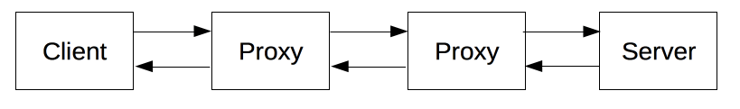

# http란 무엇인가
- Hyper Text Transfer Protocol
- HTTP는 웹에서 이루어지는 모든 데이터 교환의 기초이며, 클라이언트-서버 프로토콜이기도 합니다. 
- 클라이언트-서버 프로토콜이란 (보통 웹브라우저인) 수신자 측에 의해 요청이 초기화되는 프로토콜을 의미합니다. 
- 하나의 완전한 문서는 텍스트, 레이아웃 설명, 이미지, 비디오, 스크립트 등 불러온(fetched) 하위 문서들로 재구성됩니다

# http 기반 시스템의 구성요소
- 
- 실제로는 브라우저와 요청을 처리하는 서버 사이에는 좀 더 많은 컴퓨터들이 존재합니다: 라우터, 모뎀 등이 있죠. 웹의 계층적인 설계 덕분에, 이들은 네트워크와 전송 계층 내로 숨겨집니다. HTTP은 애플리케이션 계층의 최상위에 있습니다. 네트워크 문제를 진단하는 것도 중요하지만, 기본 레이어들은 HTTP의 명세와는 거의 관련이 없습니다.
- 클라이언트
    - 사용자 에이전트
    - 보통 웹브라우저
    - cli
- 웹서버
    - 통신 채널의 반대편에는 클라이언트에 의한 요청에 대한 문서를 제공하는 서버가 존재합니다. 서버는 사실 상 논리적으로 단일 기계입니다.이는 로드(로드 밸런싱) 혹은 그때 그때 다른 컴퓨터(캐시, DB 서버, e-커머스 서버 등과 같은)들의 정보를 얻고 완전하게 혹은 부분적으로 문서를 생성하는 소프트웨어의 복잡한 부분을 공유하는 서버들의 집합일 수도 있기 때문입니다.
    - 서버는 반드시 단일 머신일 필요는 없지만, 여러 개의 서버를 동일한 머신 위에서 호스팅 할 수는 있습니다. HTTP/1.1과 Host 헤더를 이용하여, 동일한 IP 주소를 공유할 수도 있습니다.
- 프록시
    - 웹 브라우저와 서버 사이에서는 수많은 컴퓨터와 머신이 HTTP 메시지를 이어 받고 전달합니다. 여러 계층으로 이루어진 웹 스택 구조에서 이러한 컴퓨터/머신들은 대부분은 전송, 네트워크 혹은 물리 계층에서 동작하며, 성능에 상당히 큰 영향을 주지만 HTTP 계층에서는 이들이 어떻게 동작하는지 눈에 보이지 않습니다. 이러한 컴퓨터/머신 중에서도 애플리케이션 계층에서 동작하는 것들을 일반적으로 프록시라고 부릅니다. 프록시는 눈에 보이거나 그렇지 않을 수도 있으며(프록시를 통해 요청이 변경되거나 변경되지 않는 경우를 말함) 다양한 기능들을 수행할 수 있습니다
    - 캐싱 (캐시는 공개 또는 비공개가 될 수 있습니다 (예: 브라우저 캐시))
    - 필터링 (바이러스 백신 스캔, 유해 컨텐츠 차단(자녀 보호) 기능)
    - 로드 밸런싱 (여러 서버들이 서로 다른 요청을 처리하도록 허용)
    - 인증 (다양한 리소스에 대한 접근 제어)
    - 로깅 (이력 정보를 저장)


# http의 구조

- Request 
    ``` http
    - Request HTTP
    POST /payment-sync HTTP/1.1

    Accept: application/json
    Accept-Encoding: gzip, deflate
    Connection: keep-alive
    Content-Length: 83
    Content-Type: application/json
    Host: intropython.com
    User-Agent: HTTPie/0.9.3

    {
        "imp_uid": "imp_1234567890",
        "merchant_uid": "order_id_8237352",
        "status": "paid"
    }
    ```
- Response
    ``` http
    HTTP/1.1 404 Not Found

    Connection: close
    Content-Length: 1573
    Content-Type: text/html; charset=UTF-8
    Date: Mon, 20 Aug 2018 07:59:05 GMT

    <!DOCTYPE html>
    <html lang=en>
    <meta charset=utf-8>
    <meta name=viewport content="initial-scale=1, minimum-scale=1, width=device-width">
    <title>Error 404 (Not Found)!!1</title>
    <style>
        *{margin:0;padding:0}html,code{font:15px/22px arial,sans-serif}html{background:#fff;color:#222;padding:15px}body{margin:7% auto 0;max-width:390px;min-height:180px;padding:30px 0 15px}* > body{background:url(//www.google.com/images/errors/robot.png) 100% 5px no-repeat;padding-right:205px}p{margin:11px 0 22px;overflow:hidden}ins{color:#777;text-decoration:none}a img{border:0}@media screen and (max-width:772px){body{background:none;margin-top:0;max-width:none;padding-right:0}}#logo{background:url(//www.google.com/images/branding/googlelogo/1x/googlelogo_color_150x54dp.png) no-repeat;margin-left:-5px}@media only screen and (min-resolution:192dpi){#logo{background:url(//www.google.com/images/branding/googlelogo/2x/googlelogo_color_150x54dp.png) no-repeat 0% 0%/100% 100%;-moz-border-image:url(//www.google.com/images/branding/googlelogo/2x/googlelogo_color_150x54dp.png) 0}}@media only screen and (-webkit-min-device-pixel-ratio:2){#logo{background:url(//www.google.com/images/branding/googlelogo/2x/googlelogo_color_150x54dp.png) no-repeat;-webkit-background-size:100% 100%}}#logo{display:inline-block;height:54px;width:150px}
    </style>
    <a href=//www.google.com/><span id=logo aria-label=Google></span></a>
    <p><b>404.</b> <ins>That’s an error.</ins>
    <p>The requested URL <code>/payment-sync</code> was not found on this server.  <ins>That’s all we know.</ins>
    ```


- start line
    - request 
        - method
        - request target
        - http version
    - response
        - http version
        - status code
        - status message
- headers
    - general headers
        - 전송되는 컨텐츠에 대한 정보보다는, 요청/응답이 이루어지는 날짜 및 시간등에 대한 일반적인 정보가 포함된다. 
        - Date
        - Content-Type
        - Content-Length
        - Connection 
            - 클라이언트와 서버의 연결 방식 설정 HTTP/1.1은 kepp-alive 로 연결 유지하는게 디폴트.
        - ...
    - request / response headers
        - Request header는 웹브라우저가 웹서버에 요청하는 것을 텍스트로 변환한 메시지들이다. 
        - Response Header는 반대로 웹서버가 웹브라우저에 응답하는 콘텐츠가 들어가있는 메시지이다.
        - Host
        - Accept
        - Cookie
        - ....
    - entity headers
        - 실제 주고받는 컨텐츠와 관련된 http 본문에 대한 정보가 담겨져 있다. 
- body
    - 실제 데이터 컨텐츠 / 메시지 본문이 나타난다. 콘텐츠에는 요청한 리소스에 따라 html 코드, 이미지, css, js 또는 json이 포함될 수 있다.


# http 흐름
1. Tcp 연결을 엽니다. TCP 연결은 요청을 보내거나(혹은 여러 개의 요청) 응답을 받는데 사용됩니다. 클라이언트는 새 연결을 열거나, 기존 연결을 재사용하거나, 서버에 대한 여러 TCP 연결을 열 수 있습니다
2. HTTP 메시지를 전송합니다. HTTP 메시지(HTTP/2 이전)는 인간이 읽을 수 있습니다. HTTP/2에서는 이런 간단한 메시지가 프레임 속으로 캡슐화되어 직접 읽는게 불가능하지만 원칙은 동일합니다.
    ```http
    GET / HTTP/1.1
    Host: developer.mozilla.org
    Accept-Language: fr
    ```
3. 서버에 의해 전송된 응답을 읽어들입니다
    ``` http
    HTTP/1.1 200 OK
    Date: Sat, 09 Oct 2010 14:28:02 GMT
    Server: Apache
    Last-Modified: Tue, 01 Dec 2009 20:18:22 GMT
    ETag: "51142bc1-7449-479b075b2891b"
    Accept-Ranges: bytes
    Content-Length: 29769
    Content-Type: text/html

    <!DOCTYPE html... (here comes the 29769 bytes of the requested web page)
    ```
4. 연결을 닫거나 다른 요청들을 위해 재사용합니다.
- HTTP 파이프라이닝이 활성화되면, 첫번째 응답을 완전히 수신할 때까지 기다리지 않고 여러 요청을 보낼 수 있습니다. HTTP 파이프라이닝은 오래된 소프트웨어와 최신 버전이 공존하고 있는, 기존의 네트워크 상에서 구현하기 어렵다는게 입증되었으며, 프레임안에서 보다 활발한 다중 요청을 보내는 HTTP/2로 교체되고 있습니다.