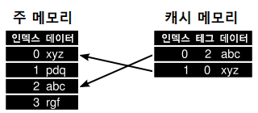

# 캐시의 지역성

## 캐시 메모리
- 주기억장치에서 자주 사용하는 프로그램과 데이터를 저장해두어 속도를 빠르게 하는 메모리
     - 그러므로 캐시는 주기억장치보다 크기가 작을 수밖에 없다.
     - 캐시 기억장치와 주기억장치 사이에엇 정보를 옮기는 것을 사상(Mapping)이라고 함.
        - 직접 매핑
        - 연관 매핑
        - 집합 연관 매핑
- 주기억장치와 CPU 사이에 위치
- 메모리 계층 구조에서 가장 빠른 소자이며, 처리속도가 거의 CPU의 속도와 비슷할 정도의 속도를 가지고 있다. 
- 캐시메모리를 사용한 주 기억장치를 접근하는 회수가 줄어들어 컴퓨터의 처리속도가 향상
- 캐시의 크기는 보통 수십 Kbyte ~ 수백 Kbyte
- 
## 캐시의 지역성 원리
캐시 메모리는 속도가 빠른 장치와 느린 장치간의 속도차에 따른 병목 현상을 줄이기 위한 범용 메모리이다. 이러한 역할을 수행하기 위해서는 CPU가 어떤 데이터를 원할 것인가를 어느 정도 예측할 수 있어야 한다. 캐시의 성능은 작은 용량의 캐리 메모리에 CPU가 이후에 참조할, 쓸모 있는 정보가 어느 정도 들어있느냐에 따라 좌우되기 떄문이다.

이때 적중률을 극대화 시키기 위해 데이터 지역성의 원리를 사용한다. 지역성의 전제조건으로 프로그램은 모든 코드나 데이터를 균등하게 Access 하지 않는다는 특성을 기본으로 한다.
즉, Locality 란 기억 장치 내의 정보를 균일하게 Access 하는 것이 아닌 어느 한 순간에 특정 부분을 집중적으로 참조하는 특성인 것이다.

이 데이터 지역성은 대표적으로 시간 지역성과 공간 지역성으로 나뉜다.

- 시간 지역성 : 최근에 참조된 주소의 내용은 곧 다음에 다시 참조되는 특성
- 공간 지역성 : 대부분의 실제 프로그램이 참조된 주소와 인접한 주소의 내용이 다시 참조되는 특성.

## Caching Line
캐시는 프로세서 가까이에 위치하면서 빈번하게 사용되는 데이터를 놔두는 장소이다. 하지만 캐시가 아무리 가까이 있더라도 찾고사 하는 데이터가 어느 곳에 저장되어 있는지 몰라 모든 데이터를 순회해야 한다면 시간이 오래 걸리게 된다. 즉, 캐시에 목적 데이터가 저장되어 있다면 바로 접근하여 출력할 수 있어야 캐시가 의미 있어진다는 것이다.

그렇기 때문에 캐시에 데이터를 저장할 특정 자료구조를 사용하여 묶음으로 저장하게 되는데 이를 캐싱 라인이라고 한다. 프로세스는 다양한 주소에 있는 데이터를 사용하므로 빈번하게 사용하는 데이터의 주소 또한 흩어져 있다. 따라서 캐시에 저장하는 데이터에는 데이터의 메모리 주소 등을 기록해 둔 태그를 달아놓을 필요가 있다. 이러한 태그들의 묶음을 캐싱 라인이라고 하고 메모리부터 가여올 때도 캐싱 라인을 기준으로 가져온다. 종류로는 대표적으로 세 가지 방식이 존재한다. 

- Full Associative
- Set Associative
- Direct Map 