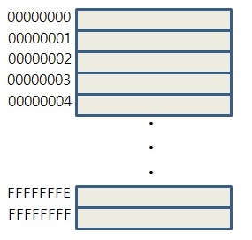
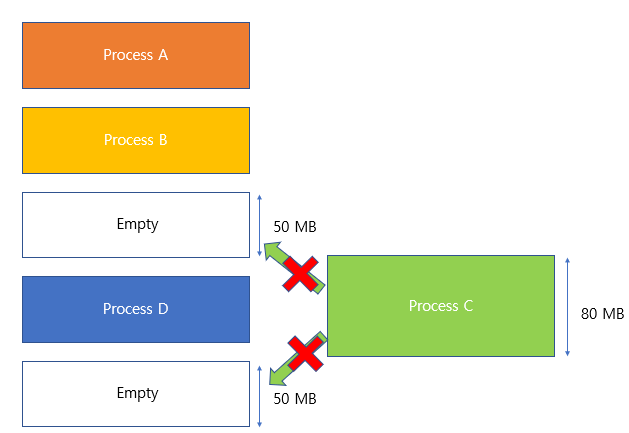
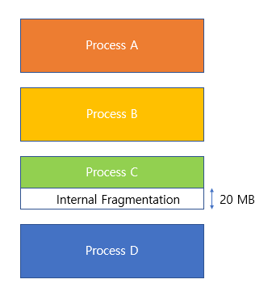

# 메모리 주소에 대하여

- 메모리 한 칸의 크기 : 1byte, 8bit

- 현대 cpu 종류로 32bit, 64bit형이 있다. 이는 cpu의 레지스터에서의 크기 즉 word의 크기를 나타내고 있는 것이다.

- 메모리 주소 포인터의 크기 : 32비트 컴퓨터에서는 포인터의 크기를 4byte로 지정할 것이고 64비트 컴퓨터에서는 8byte로 지정할 것이다. 

- 메모리의 주소값 
    - 4GB = 1byte * 2^32
    - 메모리 한 칸의 크기가 1byte인 경우 4GB 메모리에서 표현 가능한 주소값은 **0~2^32-1** 이다

    -         

- 32비트 컴퓨터에서 조작 가능한 메모리 크기가 최대 4GB인 이유
    - cpu 내의 레지스터 크기가 4byte(32bit)이기 때문에 주소 표현이 0~2^32-1 까지 가능하다
    - 위에서 설명한 4GB의 주소값의 범위와 같다.

# 메모리 관리 배경
- 각각의 프로세스는 독립된 메모리 공간을 갖고, 운영체제 혹은 다른 프로세스의 메모리 공간에 접근할 수 없는 제한이 걸려있다. 
- 단지, 운영체제만이 운영체제 메모리 영역과 사용자 메모리 영역의 접근에 제약을 받지 않는다.
- Swapping
    - 메모리의 관리를 위해 사용되는 기법
    - 표준 swapping 방식으로는 round-robin 과 같은 스케줄링의 다중 프로그래밍 환경에서 CPU 할당 시간이 끝난 프로세스의 메모리를 보조 기억장치(e.g. 하드디스크)로 내보내고 다른 프로세스의 메모리를 불러 들일 수 있다.
    - 이 과정을 swap (스왑시킨다) 이라 한다. 주 기억장치(RAM)으로 불러오는 과정을 swap-in, 보조 기억장치로 내보내는 과정을 swap-out 이라 한다. swap 에는 큰 디스크 전송시간이 필요하기 때문에 현재에는 메모리 공간이 부족할때 Swapping 이 시작된다.
- 단편화 (Fragmentation)
    - 프로세스들이 메모리에 적재되고 제거되는 일이 반복되다보면, 프로세스들이 차지하는 메모리 틈 사이에 사용하지 못할 만큼의 작은 자유공간들이 늘어나게 되는데, 이것이 단편화다
    - 외부 단편화
        - 외부 단편화란 남아있는 총 메모리 공간이 요청한 메모리 공간보다 크지만, 남아있는 공간이 연속적(contiguous)이지 않아 발생하는 현상이다.

        - 
        - 압축 : 외부 단편화를 해소하기 위해 프로세스가 사용하는 공간들을 한쪽으로 몰아, 자유공간을 확보하는 방법론 이지만, 작업효율이 좋지 않다. (위의 메모리 현황이 압축을 통해 아래의 그림 처럼 바뀌는 효과를 가질 수 있다)
    - 내부 단편화
        - 내부 단편화란 주기억장치 내 사용자 영역이 실행 프로그램보다 커서 프로그램의 사용 공간을 할당 후 사용되지 않고 남게 되는 현상을 말한다. 

        - 
- 단편화 문제를 해결하기 위한 메모리 관리 기법 2가지가 있다.
    - paging
    - segmentation

# Paging
- 외부 단편화와 압축 작업을 해소 하기 위해 생긴 방법론으로, 물리 메모리는 Frame 이라는 고정 크기로 분리되어 있고, 논리 메모리(프로세스가 점유하는)는 페이지라 불리는 고정 크기의 블록으로 분리된다.(페이지 교체 알고리즘에 들어가는 페이지)
- 페이징 기법을 사용함으로써 논리 메모리는 물리 메모리에 저장될 때, 연속되어 저장될 필요가 없고 물리 메모리의 남는 프레임에 적절히 배치됨으로 외부 단편화를 해결할 수 있는 큰 장점이 있다.
- 하나의 프로세스가 사용하는 공간은 여러개의 페이지로 나뉘어서 관리되고(논리 메모리에서), 개별 페이지는 순서에 상관없이 물리 메모리에 있는 프레임에 mapping 되어 저장된다고 볼 수 있다.
- 단점 : 내부 단편화 문제의 비중이 늘어나게 된다. 예를들어 페이지 크기가 1,024B 이고 프로세스 A 가 3,172B 의 메모리를 요구한다면 3 개의 페이지 프레임(1,024 * 3 = 3,072) 하고도 100B 가 남기때문에 총 4 개의 페이지 프레임이 필요한 것이다. 결론적으로 4 번째 페이지 프레임에는 924B(1,024 - 100)의 여유 공간이 남게 되는 내부 단편화 문제가 발생하는 것이다.

# Segmentation
- 페이징에서처럼 논리 메모리와 물리 메모리를 같은 크기의 블록이 아닌, 서로 다른 크기의 논리적 단위인 세그먼트(Segment)로 분할 사용자가 두 개의 주소로 지정(세그먼트 번호 + 변위) 세그먼트 테이블에는 각 세그먼트의 기준(세그먼트의 시작 물리 주소)과 한계(세그먼트의 길이)를 저장

- 단점 : 서로 다른 크기의 세그먼트들이 메모리에 적재되고 제거되는 일이 반복되다 보면, 자유 공간들이 많은 수의 작은 조각들로 나누어져 못 쓰게 될 수도 있다.(외부 단편화)