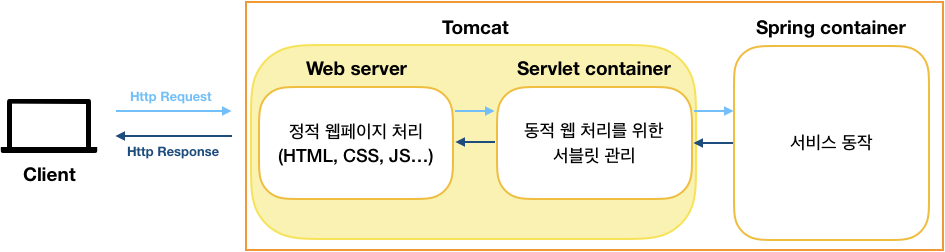

# Servlet, Spring MVC의 구조 및 동작과정

[https://12bme.tistory.com/555](https://12bme.tistory.com/555)

[https://velog.io/@suhongkim98/DispatcherServlet과-스프링-컨테이너-생성-과정](https://velog.io/@suhongkim98/DispatcherServlet%EA%B3%BC-%EC%8A%A4%ED%94%84%EB%A7%81-%EC%BB%A8%ED%85%8C%EC%9D%B4%EB%84%88-%EC%83%9D%EC%84%B1-%EA%B3%BC%EC%A0%95)

### 톰캣이란?

톰캣은 WAS의 대표적인 미들웨어 서비스이다. 

- WAS (Web Application Server)
    - web server + web container
    - web container
        - DB 조회나 다양한 로직 처리를 요구하는 동적인 콘텐츠를 제공하기 위한 기능이 있다.
        - 서블릿 컨테이너(Servlet Container)로도 불린다.
- 톰캣은 자바코드를 이용해 HTML 페이지를 동적으로 생성해주는 프로그램이다.



## Servlet

- 클라이언트의 요청을 처리하고, 그 결과를 반환하는 Servlet 클래스의 구현 규칙을 지킨 자바 웹 프로그래밍 기술
- 자바를 사용하여 웹페이지를 동적으로 생성하는 서버측 프로그램 혹은 그 사양을 말한다.
- 일반적으로 웹 프로그래밍을 한다고 하면 정의된 클라이언트의 요청에 대해 상응하는 결과를 return해 주어야 하는데 웹 페이지 혹은 결과값을 동적으로 생성해 주기위한 역할을 하는 자바 프로그램을 서블릿이라고 한다.
- 서블릿을 사용하는 이유
    - 서블릿을 사용하지 않고 직접 http 통신으로 오고가는 문자열을 파싱하여 서블릿과 같은 기능을 구현해도 무방하지만, 이미 편리하게 사용할 수 있는 서블릿을 놔두고 문자열 파싱 기능을 구현하는 것은 개발자가 비즈니스 로직에 집중하지 못하게 만든다.
- 서블릿 인터페이스
    
    ```java
    public interface Servlet {
    
        public void init(ServletConfig config) throws ServletException;
    
        public ServletConfig getServletConfig();
    
        public void service(ServletRequest req, ServletResponse res)
                throws ServletException, IOException;
    
        public String getServletInfo();
    
        public void destroy();
    }
    ```
    
- 서블릿의 라이프 사이클
    - init > service > destroy
        
        

## Servlet Container

- 서블릿들을 관리하는 역할을 한다.
- 서블릿 클래스의 로드, 초기화, 호출, 소멸까지의 라이프사이클을 직접적으로 관리한다.
- 서블릿 컨테이너는 웹서버와 통신을 통해 클라이언트의 request를 전달받아 동적 서비스를 response를 해야하는데, 해당 통신을 위해 소켓을 만드는 등의 역할을 한다.
- 클라이언트로부터 request를 받을 때 마다 쓰레드를 생성해 요청을 처리한다. 해당 쓰레드는 서블릿 컨테이너에서 쓰레드풀을 별도로 관리하여 실행하게된다.
- 서블릿 컨테이너는 개발자가 웹서버와 통신하기 위하여 소켓을 생성하고, 특정 포트에 리스닝하고, 스트림을 생성하는 등의 복잡한 일들을 할 필요가 없게 해준다.
- 컨테이너는 servlet의 생성부터 소멸까지의 일련의 과정을 관리한다. 서블릿 컨테이너는 요청이 들어올 때 마다 새로운 자바 스레드를 만든다.
- 대표적인 Servlet Container가 Tomcat이다. Tomcat 같은 was 가 java 파일을 컴파일해서 class로 만들고 메모리에 올려 servlet 객체를 만든다.
- 구조
    
    
    

## DispatcherServlet

- 프론트 컨트롤러 패턴이란
    - 요청 경로마다 서블릿을 정의해주는 것은 핸들러마다 공통된 로직 (한글 인코딩 처리 etc…)을 중복 작성한다는 비효율적인 측면이 있다. 서블릿을 개별적으로 다루어 공통된 로직을 여러번 작성하지 말고 공통된 로직을 하나의 서블릿만으로 앞단에 두어 모든 클라이언트의 요청을 처리하는 것을 프론트 컨트롤러 패턴이라 한다.
    - 컨트롤러를 구현할 때 직접 서블릿을 다루지 않아도 된다.
    - 공통 로직 처리가 가능하다.
    
- 스프링 MVC에서는 DIspatcherServlet이라는 모든 요청을 담당하는 서블릿을 두고 컨트롤러에 위임을 하여 요청을 처리한다.


- DispatcherServlet.java
    
    ```java
    @SuppressWarnings("serial")
    public class DispatcherServlet extends FrameworkServlet {
    	
        ...
    
    	public void setDetectAllHandlerMappings(boolean detectAllHandlerMappings) {
    		this.detectAllHandlerMappings = detectAllHandlerMappings;
    	}
    
    	protected void initStrategies(ApplicationContext context) {
    		initMultipartResolver(context);
    		initLocaleResolver(context);
    		initThemeResolver(context);
    		initHandlerMappings(context);
    		initHandlerAdapters(context);
    		initHandlerExceptionResolvers(context);
    		initRequestToViewNameTranslator(context);
    		initViewResolvers(context);
    		initFlashMapManager(context);
    	}
    
    	@Override
    	protected void doService(HttpServletRequest request, HttpServletResponse response) throws Exception {
            ~~~
    	}
    
    	protected void doDispatch(HttpServletRequest request, HttpServletResponse response) throws Exception {
            ~~~
    	}
    
        protected void doPost(HttpServletRequest req, HttpServletResponse resp)
            throws ServletException, IOException {
            ~~~
        }
    
        protected void service(HttpServletRequest req, HttpServletResponse resp)
            throws ServletException, IOException {
            ~~~
        }
    
        ...
    }
    
    ```
    
    [https://github.com/spring-projects/spring-framework/blob/main/spring-webmvc/src/main/java/org/springframework/web/servlet/DispatcherServlet.java](https://github.com/spring-projects/spring-framework/blob/main/spring-webmvc/src/main/java/org/springframework/web/servlet/DispatcherServlet.java)
    
- 역할
    
    클래스 내부에 여러 핸들러(Handler), 어댑터(Adapter), 리졸버(Resolver) 등을 가지고 클라이언트의 요청에 따라 개발자가 정의해 둔 내용을 응답해 줄 수 있도록 front-controller의 역할을 하고 있다.
    
    1. **Handler Mapping**
        
        Client로 부터 들어온 Request를 분석하여 매핑된 Controller가 있는지 확인합니다. 
        
    2. **HandlerAdapter**
        
        매핑 대상 Controller에게 Request 처리요청을 보냅니다. 
        
    3. **ViewResolver**
        
        Controller에서 view를 return 했을 경우, 해당하는 view를 찾아 client에게 return 합니다. 
        
    
    
    
    
    

## Spring Container

- 서블릿 컨테이너는 서블릿의 생명주기를 관리했다면, 스프링컨테이너는 Java object인 `빈`(Bean)의 라이프 사이클 관리하여 Spring 프레임워크의 특징인 `IOC(제어역전)`와 `DI(의존성주입)`을 제공해주는 역할을 합니다.
- Bean Factory
    - 컨테이너 구동 시,  Bean의 정의는 즉시 로딩하지만, Bean 자체가 필요하게 되기 전까지 인스턴스화를 하지 않고 Bean이 사용될 때 인스턴스화 하여 빈의 일생이 시작되도록 합니다.
- Application Context
    - 빈을 미리 로드한 후 원할 때 빈을 지연 없이 (Pre-Loading) 얻을 수 있는 방식을 지원한다. Application Context를 보통 우리는 **스프링 컨테이너** 또는 **IoC 컨테이너** 라고 부른다.
    - bean 객체를 생성하고 관리하는 기본적인 기능을 제공
    - 트랜잭션 관리
    - 메세지 기반의 다국어 처리
    - Aop 처리
    - 등등
- 구조
    
    