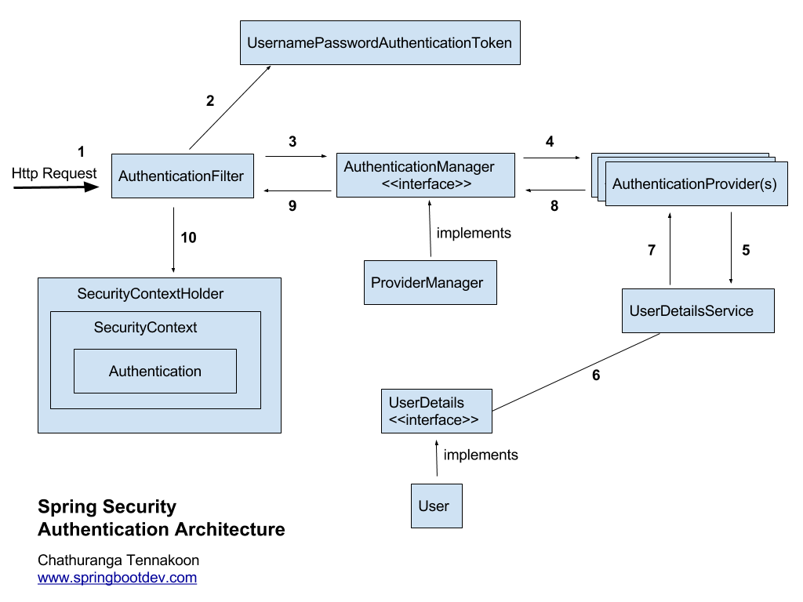

# Spring Security 동작방식

## Spring Security 란?
- 스프링 시큐리티는 스프링 기반 어플리케이션의 보안(인증과 권환, 인가)을 담당하는 스프링 하위 프레임워크이다.
- 보안과 관련해서 체계적으로 많은 옵션들을 제공해주기 때문에 개발자의 입장에서는 하나하나 보안 관련 로직을 작성하지 않아도 된다는 장점이 있다. 

## 주요 단어 정리
- 인증(Authentication) : 해당 사용자가 본인인지 확인하는 절차
- 인가(Authorization) : 인증된 사용자가 요청한 자원에 접근 가능한지 결정하는 절차
- 접근 주체(Principle) : 보호받는 Resource에 접근하는 대상
- 비밀번호(Credential) : Resource에 접근하는 대상의 비밀번호
- 권한 : 인증된 주체가 어플리케이션의 동작을 수행할 수 있도록 허락되어 있는지 결정
    - 인증 과정을 통해 주체가 증명된 이후 권한을 부여할 수 있다
    - 권한 부여에 두 가지 영역이 존재하는데 웹 요청 권한과 메서드 호출 및 도메인 인스턴스에 대한 접근 권한 부여가 있다.

> 인증 정보는 최종적으로 인메모리 세션 저장소인 SecurityContextHolder에 세션-쿠키 방식으로 저장됩니다.

## Module 정리

- SpringContextHolder
- SecurityContext
- Authentication 
- UsernamePasswordAuthenticationToken
- AuthenticationProvider

- AuthenticationManager
- UserDetails
- UserDetailsService
- PasswordEncoding
- GrantedAuthority

## 동작 과정

1. 요청 수신 
- 사용자가 form을 통해 로그인 정보(id, password)가 담긴 Request를 보낸다.

2. 토큰 생성
- AuthenticationFilter가 요청을 받아서 UsernamePasswordAuthenticationToken(인증용 객체)을 생성한다.
- UsernamePasswordAuthenticationToken은 해당 요청을 처리할 수 있는 Provider를 찾는데 사용.

3. AuthenticationFilter로 부터 인증용 객체를 전달 받는다.
- AuthenticationManager에게 처리를 위임한다.
- AuthenticationManager는 List 형태로 Provider들을 갖고있다.

4. Token을 처리할 수 있는 Authentication Provider 선택
- 실제 인증을 할 AuthenticationProvider에게 인증용 객체를 다시 전달한다.

5. 인증 절차
- 인증 절차가 시작되면 AuthenticationProvider 인터페이스가 실행되고 DB에 잇는 사용자의 정보와 화면에서 입력한 로그인 정보를 비교.

6. UserDetailsService의 loadUserByUsername 메소드 수행
- AuthenticationProvider 인터페이스에서는 authenticate() 메소드를 오버라이딩 하게 되는데 이 메소드의 파라미터인 인증용 객체로 화면에서 입력한 로그인 정보를 가져올 수 있다.

7. AuthenticationProvider 인터페이스에서 DB에 있는 사용자의 정보를 가져오려면 UserDetailsService 인터페이스를 사용한다.

8. UserDetailsService 인터페이스는 화면에서 입력한 사용자의 username으로 loadUserByUsername() 메소드를 호출하여 DB에 있는 사용자의 정보를 UserDetails 형으로 가져온다. 만약 사용자가 존재하지 않으면 예외를 던진다. 이렇게 DB에서 가져온 이용자의 정보와 화면에서 입력한 로그인 정보를 비교하게 되고, 일치하면 Authentication 참조를 리턴하고, 일치하지 않으면 예외를 던진다.

9. 인증이 완료되면 사용자 정보를 가진 Authentication 객체를 SecurityContextHolder에 담은 이후 AuthenticationSuccessHandle을 실행한다. 
실패시 AuthenticationFailureHandler를 실행한다.

## Filter 정리
1. (UsernamePassword)AuthenticationFilter
- 아이디와 비밀번호를 사용한 form 기반 인증
- 설정된 로그인 URL로 오는 요청을 감시하며, 유저 인증 처리인 AuthenticationManage를 통한 인증 실행
- 인증이 성공한다면 인증용 객체를 SecurityContext에 저장 후 AuthenticationSuccessHandler 실행
- 실패한다면 AuthenticationFailureHandler 실행

2. AuthenticationProvider
- 화면에서 입력한 로그인 정보와 DB 정보를 비교
- Spring Security의 AuthenticationProvider를 구현한 클래스로 security-conext에 provider로 등록 후 인증절차를 구현한다.
- login view에서 login-processing-url로서의 form action 진행 시 해당 클래스의 supports() > authenticate() 순으로 인증 절차 진행.

3. UserDetailsService
UserDetailsService 인터페이스는 DB에서 유저 정보를 가져오는 역할.

4. UserDetails

## 참고
https://frogand.tistory.com/188
https://wildeveloperetrain.tistory.com/50
https://velog.io/@kyungwoon/Spring-Security-%EB%8F%99%EC%9E%91-%EC%9B%90%EB%A6%AC
https://gksdudrb922.tistory.com/217